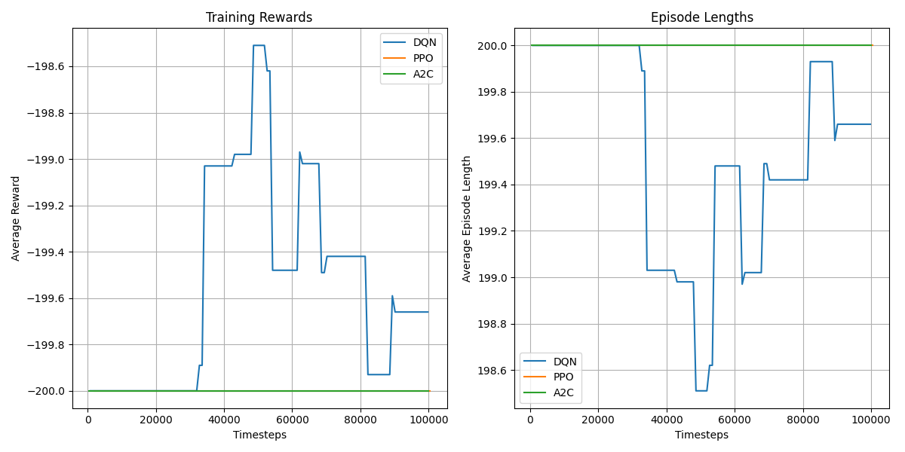

# DRL Study on MountainCar-v0: DQN, PPO, and A2C

## 1. Overview
This report summarizes a comparative study of three Deep Reinforcement Learning (DRL) algorithms—DQN, PPO, and A2C—on the Gymnasium `MountainCar-v0` environment. The goal was to analyze their performance, convergence speed, and stability under sparse and delayed reward conditions.

## 2. Training Performance
All three algorithms were trained for 100,000 timesteps. The key performance metrics are summarized in the training curves below:

### Key Observations:
- **DQN:** Initially struggled to make progress but eventually found a stable policy. Its performance was consistent but suboptimal compared to the other algorithms.
- **PPO:** Demonstrated the strongest and most stable performance, converging to a good policy relatively quickly.
- **A2C:** Showed signs of learning but was less stable than PPO, with more variance in its performance.

## 3. Agent Visualization
The qualitative behavior of the trained agents was observed through video recordings:
- **DQN:** The agent learned to build momentum but was not always successful in reaching the goal.
- **PPO:** The agent consistently and efficiently reached the goal, demonstrating a clear understanding of the environment dynamics.
- **A2C:** The agent was able to reach the goal but often took a less direct path than the PPO agent.

## 4. Conclusion
- **PPO** was the most effective algorithm for the `MountainCar-v0` environment, thanks to its stability and sample efficiency.
- **DQN** served as a good baseline but required more tuning and training time to achieve comparable results.
- **A2C** was a viable option but was ultimately outperformed by PPO in terms of stability and final performance.
